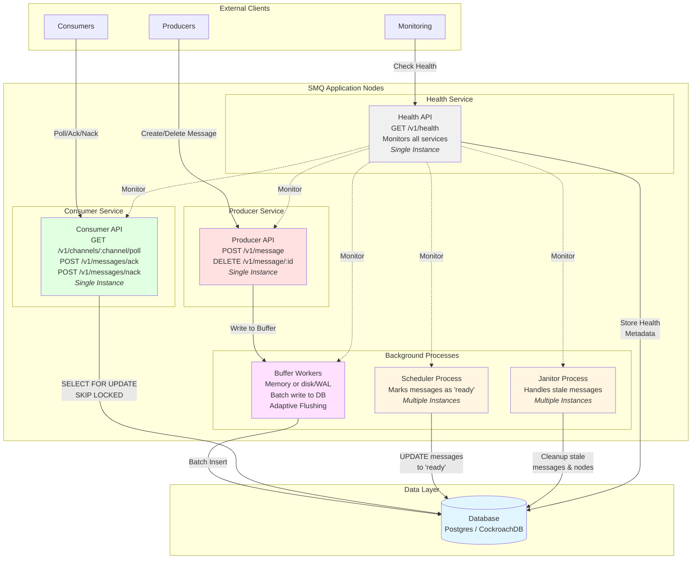

# SMQ - Scheduled message queue

A simple and lightweight, robust, and scalable message queue.

## Architecture



### Layers

1. Producer Layer (REST for message creation and deletion)
2. Consumer Layer (REST for message retrieval)
3. Scheduler Layer
4. Database Connector
5. Buffer/ Queue Pool (with Adaptive Flushing)
6. Cluster metadata/ health

### 1. Producer Layer

This layer is a REST API that enables producers to create and delete messages.
When a message is received after parsing, it is appended to the in-memory buffer
and returns an id on acceptance.

#### POST /v1/message

Create a new scheduled message

**Headers:**

```
Content-Type: application/json
api-key: <your-api-key>
```

**Request Body:**

```json
{
  "channel": "order-processing",
  "payload": {
    "order_id": "12345",
    "customer_id": "abc-123",
    "custom": "data"
  },
  "scheduled_at": 1699564800
}
```

**Fields:**

- `channel` (string, required): The channel name to send the message to
- `payload` (object, required): JSON object containing your message data (max 10 MB)
- `scheduled_at` (integer|string, required): Unix timestamp (seconds) or RFC3339 string

**Response (201 Created):**

```json
{
  "message_id": "550e8400-e29b-41d4-a716-446655440000",
  "channel": "order-processing",
  "scheduled_at": 1699564800,
  "created_at": 1699564700
}
```

**Error Responses:**

- `400 Bad Request`: Invalid JSON, missing required fields, or payload too large
- `401 Unauthorized`: Missing or invalid API key

#### DELETE /v1/message/:id

Delete a message based on the ID

**Headers:**

```
api-key: <your-api-key>
```

**Path Parameters:**

- `id` (UUID, required): The message ID to delete

**Example:**

```
DELETE /v1/message/550e8400-e29b-41d4-a716-446655440000
```

**Response (200 OK):**

```json
{
  "message_id": "550e8400-e29b-41d4-a716-446655440000",
  "deleted_at": 1699564800
}
```

**Error Responses:**

- `400 Bad Request`: Invalid UUID format
- `404 Not Found`: Message not found
- `401 Unauthorized`: Missing or invalid API key

### 2. Consumer Layer

This layer is another REST API that enables consumers to retrieve messages.

#### GET /v1/channels

List all available channels with pagination

**Headers:**

```
api-key: <your-api-key>
```

**Query Parameters:**

- `limit` (integer, optional): Number of channels to return (default: 100)
- `offset` (integer, optional): Number of channels to skip (default: 0)

**Example:**

```
GET /v1/channels?limit=50&offset=0
```

**Response (200 OK):**

```json
{
  "channels": ["order-processing", "notifications", "analytics"],
  "pagination": {
    "limit": 50,
    "offset": 0,
    "count": 3
  }
}
```

**Error Responses:**

- `400 Bad Request`: Invalid limit or offset parameters
- `401 Unauthorized`: Missing or invalid API key

#### GET /v1/channels/:channelId/poll

Poll for ready messages from a specific channel

When a consumer polls for messages, the consumer layer **atomically queries the database** to find and lock **'ready'** messages (using a `SELECT ... FOR UPDATE SKIP LOCKED` pattern). It then marks these messages as **'acquired'** and returns them to the consumer.

This ensures that even in a multi-node cluster, two consumers cannot retrieve the same message, and the consumer layer itself remains stateless.

**Headers:**

```
api-key: <your-api-key>
```

**Path Parameters:**

- `channelId` (string, required): The channel name to poll from

**Query Parameters:**

- `max` (integer, optional): Maximum number of messages to retrieve (default: 1000, min: 1, max: 500000)
- `subsidize` (boolean, optional): For multi-region databases, include messages from other regions (default: false)

**Example:**

```
GET /v1/channels/order-processing/poll?max=100&subsidize=false
```

**Response (200 OK):**

```json
{
  "messages": [
    {
      "id": "550e8400-e29b-41d4-a716-446655440000",
      "channel": "order-processing",
      "payload": {
        "order_id": "12345",
        "customer_id": "abc-123"
      },
      "scheduled_at": "2024-11-10T10:00:00Z",
      "status": "ACQUIRED",
      "acquired_at": "2024-11-10T10:05:00Z",
      "retry_count": 0,
      "created_at": "2024-11-10T09:55:00Z"
    }
  ]
}
```

**Error Responses:**

- `400 Bad Request`: Invalid channel ID or query parameters
- `401 Unauthorized`: Missing or invalid API key
- `500 Internal Server Error`: Failed to poll messages

#### POST /v1/messages/ack

Acknowledge successful message processing

A message is required to be "acked" by the consumer via API. This will **permanently delete the message** from the database, confirming it was successfully processed.

**Headers:**

```
Content-Type: application/json
api-key: <your-api-key>
```

**Request Body:**

```json
{
  "message_ids": [
    "550e8400-e29b-41d4-a716-446655440000",
    "660e8400-e29b-41d4-a716-446655440001"
  ]
}
```

**Fields:**

- `message_ids` (array of UUIDs, required): Message IDs to acknowledge (min: 1, max: 1000)

**Response (200 OK):**

```json
{
  "success": true,
  "count": 2
}
```

**Error Responses:**

- `400 Bad Request`: Invalid JSON, invalid UUID format, or batch size out of range
- `401 Unauthorized`: Missing or invalid API key
- `500 Internal Server Error`: Failed to acknowledge messages

#### POST /v1/messages/nack

Negative acknowledge (reject) message processing

A message can be "nacked" by the consumer via API. This indicates a processing failure. The message will be marked as **'ready'** again (instead of 'acquired') to be retrieved immediately by another consumer, and its retry count will be incremented.

If a message hits the threshold for retries, it will be marked as "failed" and automatically placed in the channel's dead letter queue.

**Headers:**

```
Content-Type: application/json
api-key: <your-api-key>
```

**Request Body:**

```json
{
  "message_ids": [
    "550e8400-e29b-41d4-a716-446655440000",
    "660e8400-e29b-41d4-a716-446655440001"
  ]
}
```

**Fields:**

- `message_ids` (array of UUIDs, required): Message IDs to negative acknowledge (min: 1, max: 1000)

**Response (200 OK):**

```json
{
  "success": true,
  "count": 2
}
```

**Error Responses:**

- `400 Bad Request`: Invalid JSON, invalid UUID format, or batch size out of range
- `401 Unauthorized`: Missing or invalid API key
- `500 Internal Server Error`: Failed to nack messages

### 3. Scheduler Layer

The Scheduler Layer is a **stateless** background process. Its primary job is to find messages that have reached their scheduled time and make them available for consumption. It is **not** responsible for locking or "acquiring" messages.

It periodically polls the database and runs a simple update:
`UPDATE messages SET status = 'ready' WHERE status = 'pending' AND scheduled_at <= NOW()`

This layer (or a separate 'Janitor' process) is also responsible for handling stale, acquired messages. If a message remains 'acquired' for too long (e.g., a consumer node died without sending an `ack`/`nack`), the janitor will mark it as **'ready'** again and increment its retry count, allowing another consumer to pick it up.

### 4. Database Connector

This layer is an abstraction layer that allows communication with different database types. The choice of database **fundamentally dictates the deployment architecture and scale**.

- **Small Deployments (Single-Node Postgres):** Recommended for development, testing, or small-scale use. All application nodes (regardless of region) connect to a single database. This is simple to manage but will have high latency for remote nodes and represents a single point of failure.

- **Large Deployments (Single-Region HA):** For larger-scale, single-region production workloads, a high-availability Postgres setup (e.g., Amazon Aurora, or Postgres with read replicas) is recommended. All application nodes run in the same region as the database for low latency.

- **Global Scale (Multi-Region Active-Active):** For true multi-region, horizontally scalable deployments, a globally distributed database like **CockroachDB** is required. In this model, application nodes are stateless and connect to the global cluster. They are designed to query their _local_ database nodes first, providing low latency, high availability, and surviving entire region failures.

### 5. Buffer/ Queue Pool

This layer provides an intelligent batching mechanism that accumulates messages before writing to the database, significantly reducing the number of database round trips and improving overall write performance.

#### Buffer Types

**Memory Buffer:**

- Ultra-fast in-memory batching
- Best for: High-throughput scenarios where maximum speed is required
- Trade-off: Messages in buffer are lost if process crashes before flush

**Disk Buffer (WAL):**

- Write-Ahead Log (WAL) for crash recovery
- Best for: High-durability scenarios where message loss is unacceptable
- Trade-off: Slightly slower due to disk I/O, but provides resilience

#### Adaptive Flushing

SMQ's buffers support **adaptive flushing**, which automatically adjusts batch sizes based on real-time database performance and message throughput. This prevents common scalability bottlenecks:

**How It Works:**

The adaptive algorithm monitors flush performance and adjusts the batch size dynamically:

1. **Overlap Prevention:** If a flush takes longer than 50% of the flush interval, the buffer reduces batch size to ensure flushes complete before the next interval trigger. This prevents cascading delays.

2. **Throughput Optimization:** When the buffer fills to capacity quickly and flushes complete in <25% of the interval, batch size is doubled (up to configured max) to maximize throughput.

3. **Low-Traffic Efficiency:** When the buffer is <25% full at flush time, batch size is reduced to conserve memory and reduce unnecessary database load.

**Monitoring:**

Adaptive buffer metrics are exposed in the health endpoint:

```json
"metadata": {
    "adaptive_enabled": true,
    "adaptive_max_size": 1000,
    "adaptive_min_size": 10,
    "adaptive_tune_threshold": 5,
    "avg_flush_duration": "0s",
    "base_max_size": 10,
    "current_batch_size": 0,
    "flush_count": 0,
    "is_running": true,
    "last_flush": "2025-11-13T03:48:00.654802-05:00",
    "last_flush_error": null,
    "max_size": 10,
    "messages_dropped": 0,
    "time_since_flush": "304.5µs",
    "total_flush_errors": 0,
    "total_flushed": 0,
    "type": "disk",
    "wal_path": "./smq_wal.log",
    "wal_size_bytes": 0,
    "wal_size_mb": "0.00",
    "worker_count": 1
},
```

**When to Enable:**

- **Enable adaptive flushing** for production workloads with variable traffic patterns
- **Disable adaptive flushing** for predictable, steady-state workloads where manual tuning suffices
- **Always enable** in multi-region deployments where database latency varies

### 6. Cluster metadata/ health

This layer polls all other layers' health and metadata, then reports to the data store for cluster health monitoring.

#### GET /v1/health

Returns the health of the cluster which includes a paginated list of nodes and their health

**Headers:**

```
api-key: <your-api-key>
```

**Query Parameters:**

- `limit` (integer, optional): Number of nodes to return (default: 100)
- `offset` (integer, optional): Number of nodes to skip (default: 0)

**Example:**

```
GET /v1/health?limit=50&offset=0
```

**Response (200 OK):**

```json
{
  "nodes": [
    {
      "node_id": "550e8400-e29b-41d4-a716-446655440000",
      "region": "us-east-1",
      "last_heartbeat": "2024-11-10T10:05:00Z",
      "status": "healthy",
      "version": "1.0.0"
    },
    {
      "node_id": "660e8400-e29b-41d4-a716-446655440001",
      "region": "us-west-2",
      "last_heartbeat": "2024-11-10T10:05:05Z",
      "status": "healthy",
      "version": "1.0.0"
    }
  ],
  "pagination": {
    "limit": 50,
    "offset": 0,
    "count": 2
  }
}
```

**Error Responses:**

- `401 Unauthorized`: Missing or invalid API key
- `500 Internal Server Error`: Failed to retrieve cluster health
